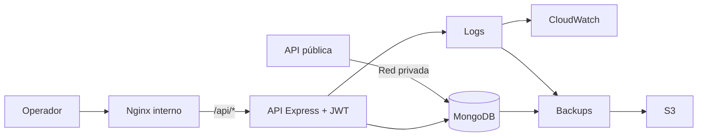

# AeroOps AWS — Operaciones Internas y Plano de Datos

[English](README.md) · [Español](README.es.md)

> Capa interna de una simulación de reservaciones en AWS: administración, analítica operativa, autenticación y plano de datos MongoDB.

> **Proyecto de portafolio / simulación educativa.** No está afiliado, respaldado ni operado por Aeroméxico.

## El reto

Este repositorio representa la parte restringida de una arquitectura dividida en dos planos.

- el repo público atiende tráfico de clientes;
- este repo concentra administración y MongoDB;
- el API interno está protegido con JWT;
- Nginx funciona como entrada al panel interno;
- logs y respaldos forman parte del diseño operativo;
- secretos y credenciales se inyectan por variables de entorno.

Repositorio complementario: **[AeroOps AWS — Public Flight Reservation Service](https://github.com/armaabetancourtt/public-profinaldevops)**.

## Arquitectura



## Qué construí

- Login administrativo con bcrypt y JWT.
- Dashboard de métricas de reservaciones e ingresos.
- Gestión y filtrado de reservaciones.
- Agregación de clientes a partir del historial.
- Gestión de vuelos y administradores.
- MongoDB como plano de datos compartido.
- Redes Docker separadas para DB y administración.
- Logs con Winston.
- Backups de MongoDB y logs con subida opcional a S3.

## Ejecución local

```bash
git clone https://github.com/armaabetancourtt/priv-profinaldevops.git
cd priv-profinaldevops
cp .env.example .env

# Configura JWT_SECRET, ADMIN_EMAIL y ADMIN_PASSWORD
docker compose up -d --build
```

Abre `http://localhost:8090`.

El backend administrativo y MongoDB no se publican directamente al host.

## Seguridad

- Sin secretos hardcodeados.
- Sin contraseña administrativa por defecto en el repo.
- `.env`, logs y backups ignorados por Git.
- API interno accesible a través de Nginx.
- MongoDB aislado dentro de la red Docker.

Consulta [docs/ARCHITECTURE.md](docs/ARCHITECTURE.md) y [SECURITY.md](SECURITY.md) para el detalle.
