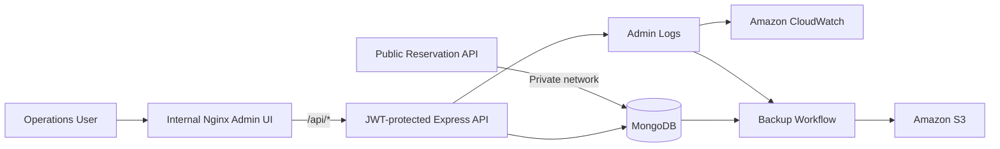

# AeroOps AWS — Internal Operations & Data Plane

[English](README.md) · [Español](README.es.md)

> Internal half of a two-tier AWS flight-reservation simulation: administration, operational analytics, authentication, and the MongoDB data plane.


> **Portfolio project / educational simulation.** This project is not affiliated with, endorsed by, or operated by Aeroméxico.

## Why this project matters

This repository demonstrates the **restricted side** of a split cloud architecture.

Instead of placing customer traffic, administration, and the database in the same trust zone, the project separates them:

- the public repository handles Internet-facing reservation traffic;
- this repository owns the administrative control plane and MongoDB;
- JWT-protected APIs manage bookings, flights, clients, and admin users;
- logs and database backups are treated as operational assets;
- the internal API is reachable only through the internal Nginx tier in the local/container topology.

The companion repository is **[AeroOps AWS — Public Flight Reservation Service](https://github.com/armaabetancourtt/public-profinaldevops)**.

## Architecture



See [docs/ARCHITECTURE.md](docs/ARCHITECTURE.md) for the complete system view.

## What I built

### Internal operations
- Authenticated admin login using bcrypt password hashing and JWT sessions.
- Reservation search, filtering, status updates, and deletion.
- Operational dashboard metrics including booking counts, revenue, route activity, and airline distribution.
- Client aggregation derived from booking history.
- Flight management endpoints.
- Administrative-user management.

### Data / platform layer
- MongoDB 6 as the shared data plane.
- Docker Compose networks separating data and admin communication.
- Nginx reverse proxy in front of the admin API.
- Winston log persistence.
- Backup workflow for MongoDB and admin logs.
- Optional upload of backup artifacts to Amazon S3.
- Environment-driven secrets and runtime configuration.

## System relationship

| Repository | Responsibility | Exposure |
|---|---|---|
| [`public-profinaldevops`](https://github.com/armaabetancourtt/public-profinaldevops) | Customer-facing search and booking experience | Internet-facing |
| **This repository** | Admin control plane, analytics, authentication, MongoDB | Internal / restricted |

## Technology

| Layer | Stack |
|---|---|
| Admin frontend | HTML5, CSS3, JavaScript, Vue 3 (CDN), Nginx |
| API | Node.js, Express |
| Authentication | bcryptjs, JWT |
| Data | MongoDB 6, Mongoose |
| Containers | Docker, Docker Compose |
| Observability | Winston, Amazon CloudWatch-oriented logging |
| Automation | Bash |
| Cloud operations | AWS EC2, VPC/private networking concepts, S3 |

## Run locally

```bash
git clone https://github.com/armaabetancourtt/priv-profinaldevops.git
cd priv-profinaldevops

cp .env.example .env
# Set strong local values for JWT_SECRET, ADMIN_EMAIL and ADMIN_PASSWORD.

docker compose up -d --build
```

Open:

```text
http://localhost:8090
```

The admin backend is **not published directly to the host**. Nginx reaches it over the internal Docker network.

## Runtime configuration

Required values:

```env
JWT_SECRET=<long-random-secret>
ADMIN_EMAIL=<demo-admin-email>
ADMIN_PASSWORD=<strong-demo-password>
```

Do not commit a real `.env` file.

## API surface

All endpoints except `/auth/login` and `/health` require a valid JWT.

| Method | Endpoint | Purpose |
|---|---|---|
| POST | `/auth/login` | Authenticate an admin |
| GET | `/auth/me` | Return current admin |
| GET | `/stats` | Operational dashboard metrics |
| GET | `/bookings` | Search/filter bookings |
| PATCH | `/bookings/:id/status` | Update booking state |
| DELETE | `/bookings/:id` | Delete booking |
| GET | `/flights` | List flight data |
| POST | `/flights` | Create flight |
| PUT | `/flights/:id` | Update flight |
| DELETE | `/flights/:id` | Delete flight |
| GET | `/clients` | Aggregate client activity |
| GET | `/admins` | List administrators |
| POST | `/admins` | Create administrator |
| DELETE | `/admins/:id` | Delete administrator |
| GET | `/health` | Health check |

## Operational commands

```bash
./scripts/start_app.sh
./scripts/view_logs.sh
./scripts/backup.sh
./scripts/backup.sh --s3 <bucket-name>
./scripts/stop_app.sh
```

## Security improvements

- No default JWT secret in source code.
- No default admin password in source code.
- Admin API is not host-published in Compose.
- MongoDB is not host-published in Compose.
- Secrets live in environment variables.
- `.env`, logs and backups are excluded from Git.
- Nginx is the intended internal ingress to the API.

See [SECURITY.md](SECURITY.md).

## Project status

Built as a cloud/DevOps portfolio project to demonstrate service boundaries, application networking, data persistence, authentication, operational telemetry and automation in a system larger than a single web app.
