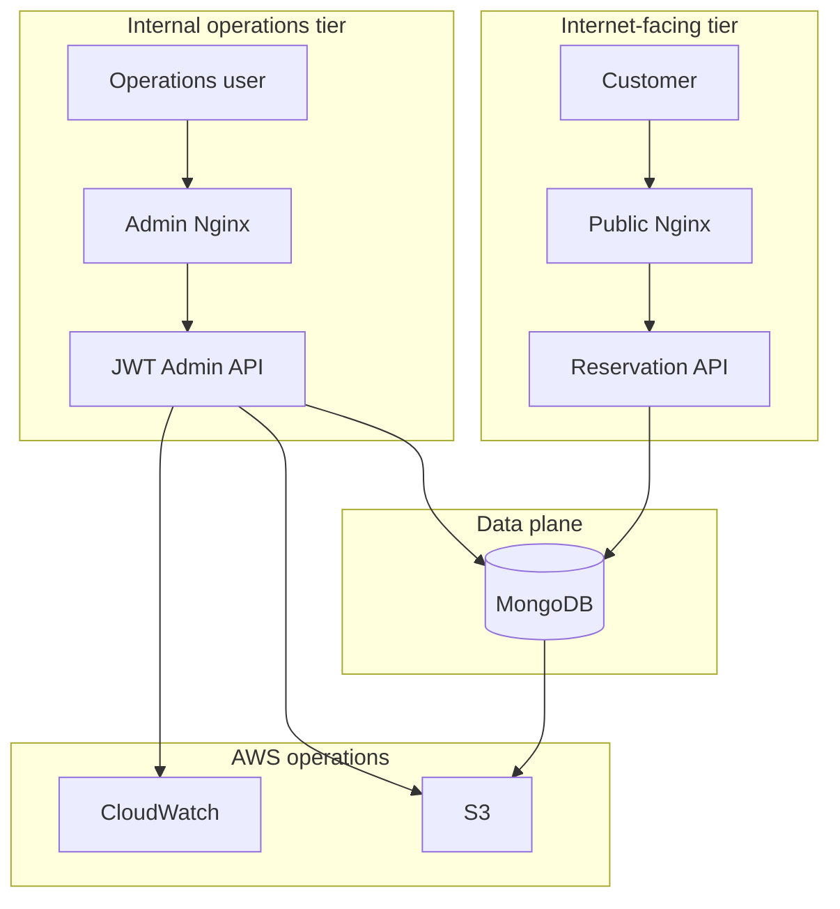

# Architecture

## Purpose

This repository is the internal operations and data plane for the AeroOps AWS portfolio project.

The system is intentionally split across two repositories to model separate trust zones.

## Docker network model

Two Docker networks make the local trust boundaries explicit:

- `backend-net`: MongoDB and the admin API communicate here.
- `admin-net`: the admin frontend and admin API communicate here.

MongoDB has no host-published port. The admin API uses `expose` instead of `ports`, so Nginx can reach it but it is not directly reachable from the host.

## Authentication

Passwords are stored as bcrypt hashes.

The seed admin is created only when `ADMIN_EMAIL` and `ADMIN_PASSWORD` are supplied. JWT signing requires `JWT_SECRET`; the application fails fast when it is absent.

This is intentionally different from the original implementation, which included demo credentials and a fallback JWT secret directly in source.

## Shared data plane

The public reservation API and the internal administration API are designed to operate on the same booking/route data model.

In a local all-in-one topology, the public tier can use MongoDB over a shared/private network. In AWS, the equivalent is an internal endpoint reachable through VPC networking rather than an Internet-exposed database.

## Operational analytics

The admin API computes:
- booking totals and state counts;
- confirmed-revenue aggregation;
- unique passenger counts;
- popular routes;
- bookings and revenue over time;
- booking distribution by airline.

These values are computed from MongoDB rather than maintained as duplicated counters.

## Observability and backup

Winston writes application logs to a persistent volume.

The backup workflow:
1. executes `mongodump` inside the MongoDB service;
2. archives admin logs;
3. optionally uploads both artifacts to S3;
4. deletes local artifacts older than the retention window.

CloudWatch is the intended cloud log/alerting destination in the AWS deployment design.

## Production considerations

A production-grade evolution would replace/extend this design with:
- managed database infrastructure;
- Secrets Manager or Parameter Store;
- least-privilege IAM roles;
- TLS and private DNS;
- VPN/SSM/bastion access for operations;
- immutable CI/CD deployments;
- audit trails and fine-grained RBAC;
- centralized metrics/tracing;
- automated restore testing.
